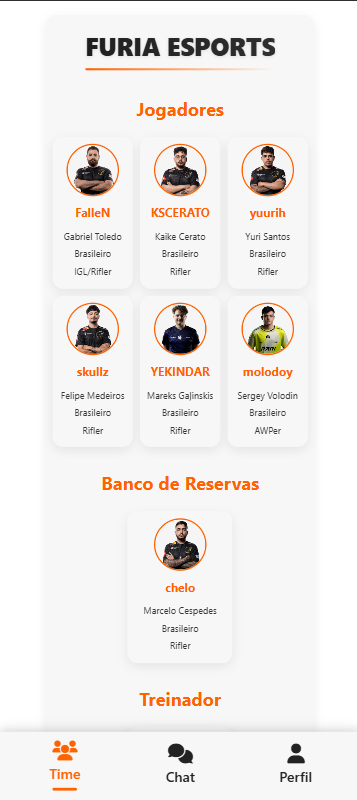
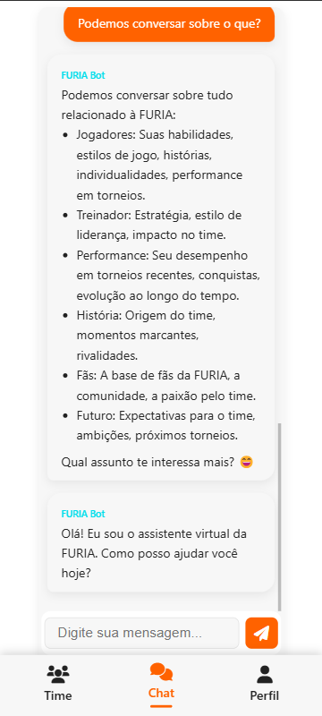
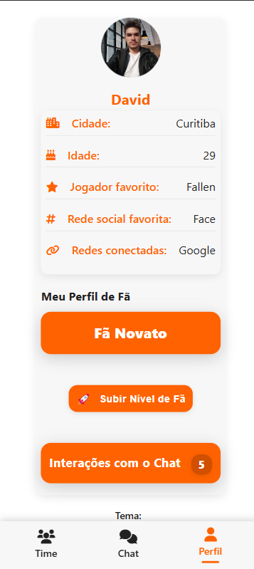

# FURIA Fan Hub

Este é um aplicativo web para fãs da FURIA Esports, desenvolvido em HTML, CSS e JavaScript, com autenticação via Google, integração com Firebase e dados esportivos via SportsData API.

## 📸 Prints do App

Adicione aqui prints do seu app para mostrar como ele funciona:

```
[Coloque aqui suas imagens de tela, por exemplo:]



```

## Funcionalidades
- Login com Google
- Chat em tempo real
- Perfil do usuário
- Estatísticas e informações do time FURIA
- Responsivo para desktop e mobile

## Como rodar localmente

1. **Clone o repositório:**
   ```bash
   git clone https://github.com/seu-usuario/seu-repo.git
   cd seu-repo
   ```

2. **Instale o http-server (caso não tenha):**
   ```bash
   npm install -g http-server
   ```

3. **Adicione suas chaves de API:**
   - **Firebase:**  
     Abra os arquivos abaixo e substitua os valores dos campos do objeto `firebaseConfig` pelas suas credenciais do Firebase:
     - `js/firebase-init.js`
     - `js/firebase-manager.js`
     - `js/firebase-config.js`
     - `js/init-firebase.js`
   - **SportsData API:**  
     Abra os arquivos abaixo e substitua o valor do campo da chave por sua chave da SportsData.io:
     - `index.html` (procure por `SUA_SPORTSDATA_API_KEY`)
     - `js/config.js`
     - `js/app.js`
   - **Importante:**  
     Não deixe suas chaves reais em repositórios públicos! Use apenas para testes ou configure variáveis de ambiente em produção.

4. **Inicie o servidor local:**
   ```bash
   npx http-server -p 8080
   ```
   Acesse [http://localhost:8080](http://localhost:8080) no navegador.

## Configuração das APIs

### Firebase
- Crie um projeto no [Firebase Console](https://console.firebase.google.com/)
- Ative o Authentication (Google)
- Ative o Firestore Database
- Copie as credenciais do seu projeto e substitua nos arquivos indicados acima.

### SportsData API
- Crie uma conta em [SportsData.io](https://sportsdata.io/)
- Pegue sua chave de API e substitua nos arquivos indicados acima.

## Deploy no Vercel
1. Instale o Vercel CLI:
   ```bash
   npm install -g vercel
   ```
2. Faça login:
   ```bash
   vercel login
   ```
3. Faça o deploy:
   ```bash
   vercel --prod
   ```

## Personalização
- Altere as cores, logos e textos nos arquivos HTML/CSS conforme desejar.
- Para trocar o favicon, substitua o arquivo em `assets/furia-logo.png`.
- Adicione prints do seu app na seção "Prints do App" acima.

## Licença
Este projeto é open-source e pode ser adaptado livremente.